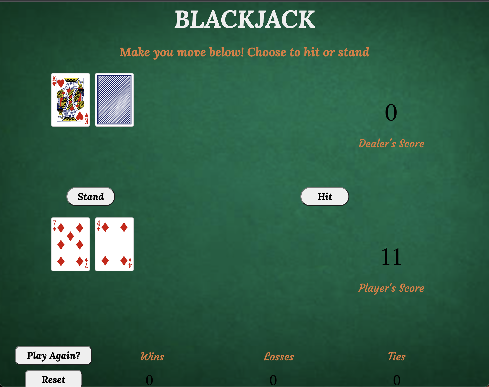
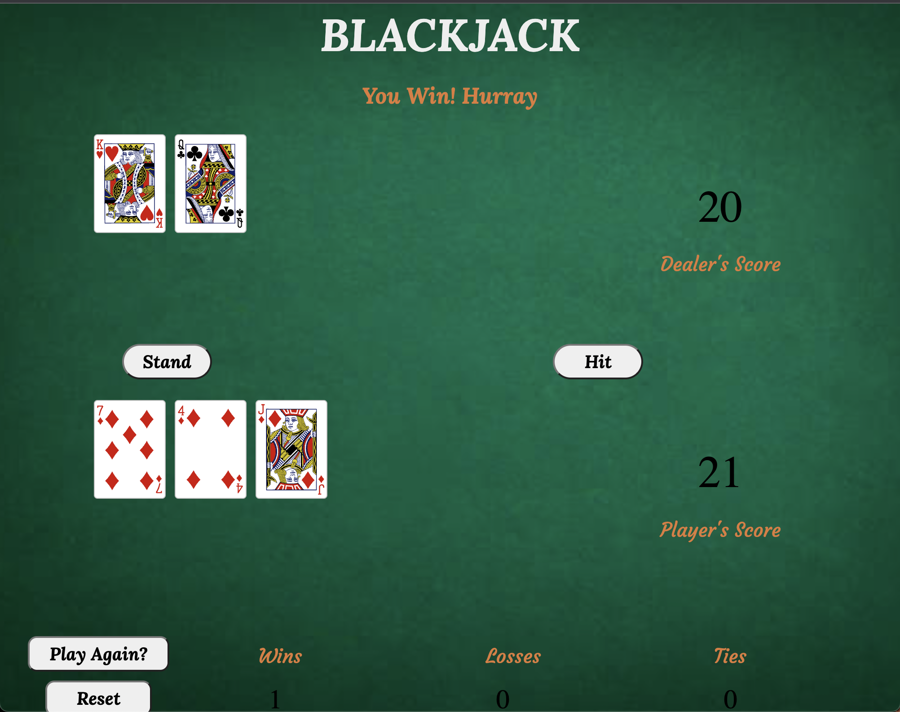
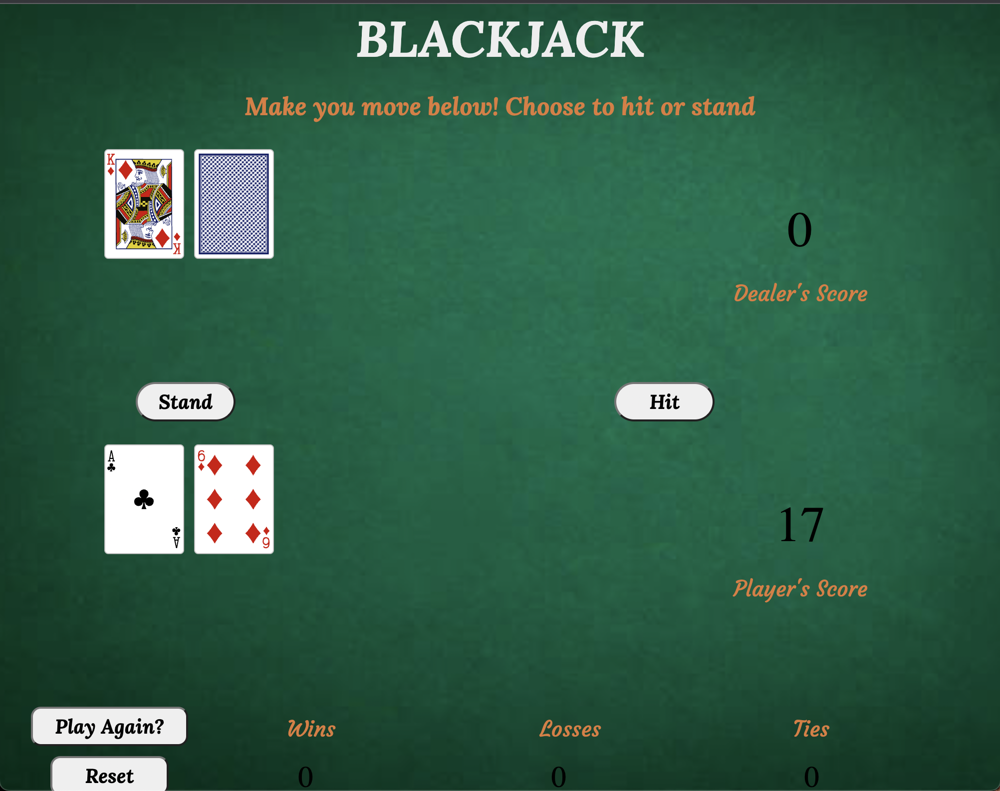
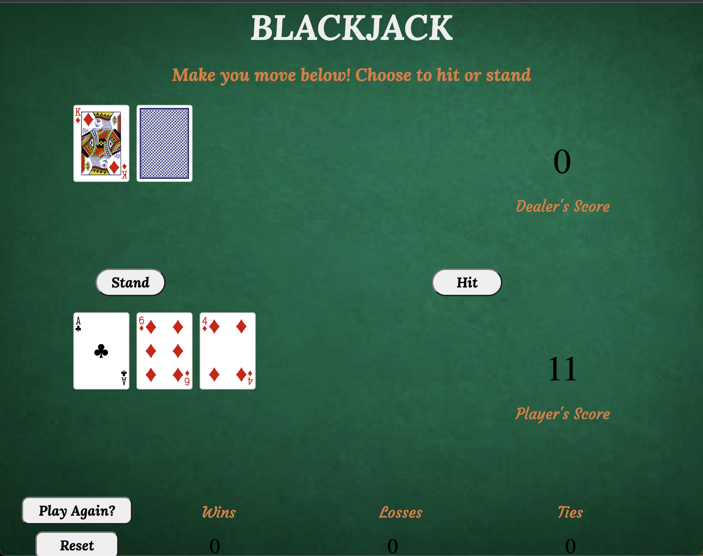
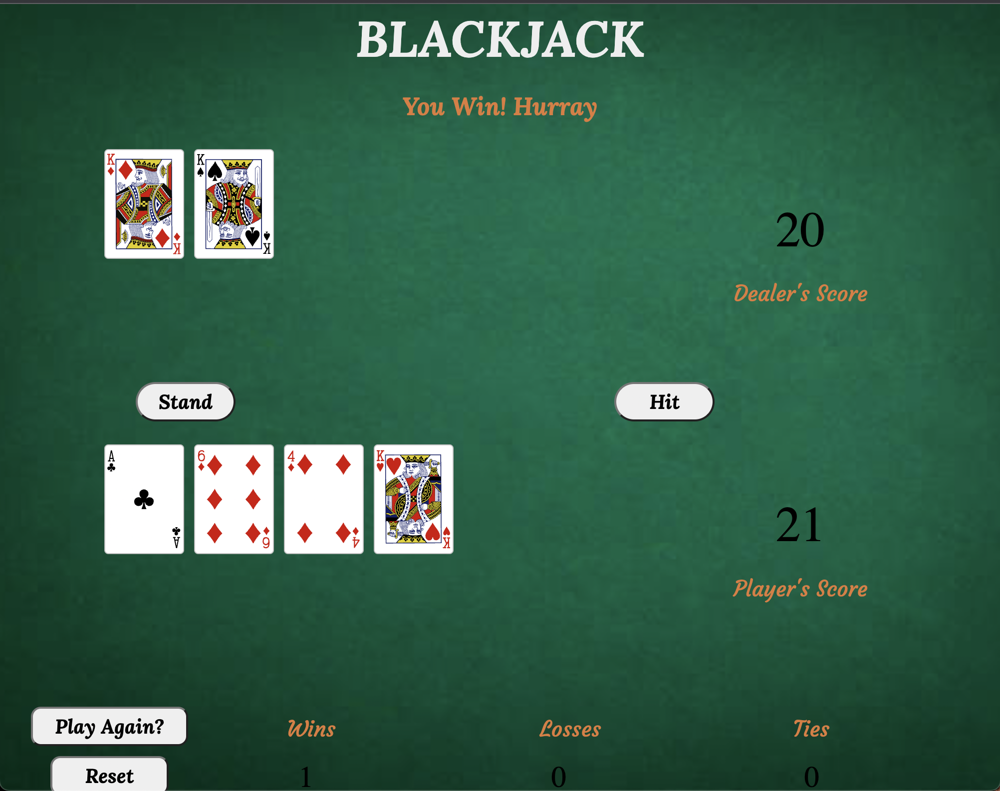

# BlackJack - The Cards Game

## Overview
---
#### BlackJack is a most popular and widely played casino banking game in the world. It uses decks of 52 cards and descends from a global family of casino banking games known as Twenty-One. BlackJack Players do not compete against each other. The game is comparing card game where each player competes against the dealer.

## Technologies
---
#### I utilized HTML and CSS to build user interface to with the combination of color to make it user friendly with the thought of keeping it simple but decent. I also used JavaScript to implement game rules to make it like a real game.
#### I implemented Model-View-Controller(MVC) to make it easy to navigate through the gameplay and render game rules logic in the web browser. 

## Start Game View:

#### In Start, when player will click on play, two card will be dealed to each player and dealer one by one. The player's cards will be faced up while dealer's one card will be faced down to make it more interesting. 

#### Once the cards will be dealed to player and dealer, player will choose to hit or stand according to the points player have from the first two cards.
* If player will have less than 21 points then player can choose to hit and continue to get more cards to go closer to 21 points.
* If player will choose to stand, dealer's second card will be faced up and will be dealed with more cards to go closer to 21 points or more than player's points to win the game.
---

## Decide Aces Value:

#### Above image shows that the cards are dealed to player and dealer but the player has one ace in the hand, in situations like this, player can decide to have value 11 or 1 for the aces in hand to keep it below 21.

#### When player choose to hit and if the player's points are above 21, the value of aces in hand will be considered 1 instead of 11.

#### The end result will display player's hand and dealer's hand. Also, it will display score for both player and winner and number of Win/Loss/Tie for the player at the bottom.
---

## Getting Started:
[Click To Start Game](https://vivek1999patel.github.io/BlackJack/)
* Follow the instruction on the top! Have Fun!
---

## Next Steps:
1. Add Bet options for the players to make some money.
2. Add Audio and impove UI to make the game more user interactive.
3. Make it responsive for the mobile users.
4. Add option for user to use their name.
5. Add copyrights footer.